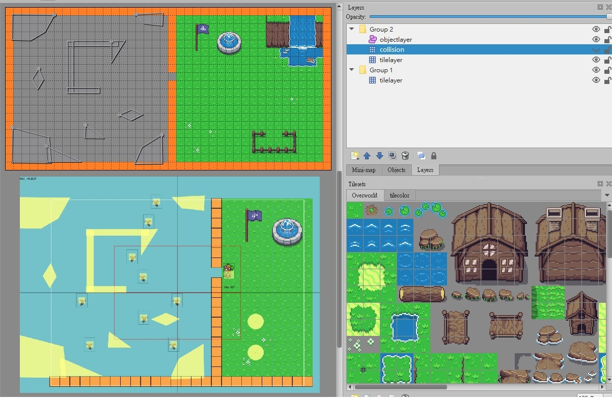

# 2D-basicImplement


## Demo

操作方式: 上下左右、空白鍵衝刺、 Z 攻擊、X 遠程、T 開啟Debug、WASD移動視角、R 重製視角
- [標準場景](https://davidhsu666.com/downloads/GameEngineT/engineDemo/gameshow1/)
- [事件觸發器:上下坡時改變Zindex更換碰撞圖層](https://davidhsu666.com/downloads/GameEngineT/engineDemo/game2/)
- [多邊形碰撞場景:可編輯多邊形及基本碰撞回饋](https://davidhsu666.com/downloads/GameEngineT/engineDemo/gameshow2/)


## Run
```
num install http-server
cd 2D-basicImplement
http-server
open 127.0.0.1:8080/src
```

## Main Features

- 攝影機：支持視角追蹤、WASD控制視角並顯示範圍內的物體
- 動態碰撞盒：使用分離軸定理處理多邊形與圓形的碰撞檢測與回饋
- 事件觸發器：設定物體碰撞後該處發的事件(處理上下坡、速度變更和對話區域等地圖事件)
- 自訂地圖存取：通過編輯JSON文件生成地圖，支持圖層編輯和讀取多邊形碰撞體
- Debug：顯示圖層和碰撞層，幫助測試和調試

## Map Edit

Create map file:

1. open [tiled-windows](https://github.com/mapeditor/tiled/releases/tag/v1.2.0)
2. New map (地圖方向: orthogonal,圖層格式: CSV,圖塊繪製順序: 右下)
3. Save as json file

Create tileset:

1. New Tileset(基於圖塊集圖像,No Embed in map)
2. 來源: 選擇tile圖片
3. Save As json file

Edit map:

在Layers區域，每個圖層以Group包起來，zindex=Group層數*10 (start from 0)

玩家預設zindex為15，會往下找最近的圖層做碰撞，所以預設就是兩層Group，Group1為地面、Group2為玩家層數及預設的地圖碰撞層

使用以下結構編輯:
```
Group 2 (zindex=10)
-objectlayer
-collision
-tilelayer

Group 1 (zindex=0)
-objectlayer
-collision
-tilelayer
```

Use mapFile:

編輯Setting.js，將地圖的圖片+檔案放置在同個資料夾中，其中key為檔名,value為檔案路徑

```js

var assetSource = {
    imgs: {
        'defaultMap_tilecolor':'../asset/map/defaultMap/defaultMap_tilecolor.png'
    },
    sounds: {

    },
    jsons: {
        'defaultMap':'../asset/map/defaultMap/defaultMap.json',
        'defaultMap_tilecolor':'../asset/map/defaultMap/defaultMap_tilecolor.json'
    }
};

var map = new TileMap2(world, asset.jsons['defaultMap']);
```

