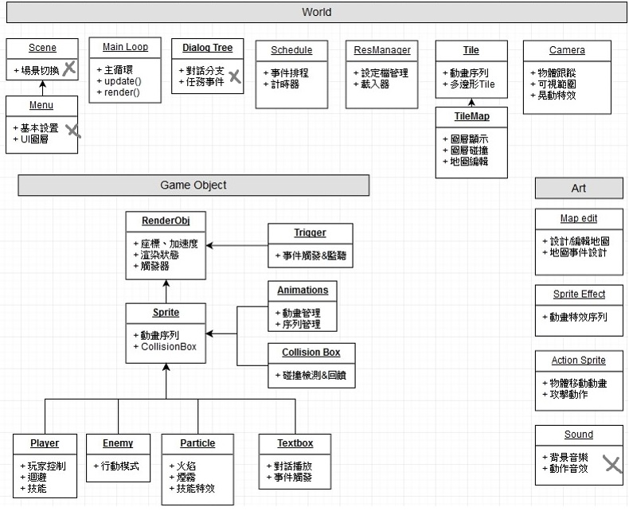

# 2D-basicImplement


## Demo

操作方式: 上下左右、空白鍵衝刺、 Z 攻擊、X 遠程、T 開啟Debug、WASD移動視角、R 重製視角
- [標準場景](https://davidhsu666.com/downloads/GameEngineT/engineDemo/gameshow1/)
- [事件觸發器:上下坡時改變Zindex更換碰撞圖層](https://davidhsu666.com/downloads/GameEngineT/engineDemo/game2/)
- [多邊形碰撞場景:可編輯多邊形及基本碰撞回饋](https://davidhsu666.com/downloads/GameEngineT/engineDemo/gameshow2/)


## Run
```
$ cd 2D-basicImplement
$ npm install http-server
$ http-server
open 127.0.0.1:8080/src
```

## Main Features

- Sprite Animation : 自由的選擇動畫序列與間隔
- 凸多邊形碰撞盒與碰撞優化 : 使用分離軸定理處理碰撞與回饋
- 事件觸發器 : 設定物體碰撞後該處發的事件(處理上下坡、速度變更和對話區域等地圖事件)
- Entity物件 : 集成物體所需的功能單元，透過多型與繼承，統一更新與管理狀態
- 攝影機 : 支持視角追蹤、WASD控制視角並顯示範圍內的物體、顯示Debug狀態，幫助測試和調試
- 自訂地圖存取 : 通過編輯JSON文件生成地圖，圖層編輯、讀取並生成多邊形碰撞體、地圖的物件動畫


## Sprite Animation


輸入每一張圖片的寬高、縮放、圖片、一秒幾張、以及動畫序列，即可自動播放並隨時切換序列，也可透過是否播放完畢來改變下一個狀態
```js
pAni = {
    frameWidth: 17,
    frameHeight: 25,
    renderScale: 2,
    imgName: 'player',
    speed: 15,
    action: {
        'walk-right': '17,18,19,20,19,18,17,16,15,14,15,16',
        'default': '3'
    }
};

animation = new Animation(pSheet, pAni);
animation.setStartEnd(pAni['default']);// 站著的靜止圖片
animation.setStartEnd(pAni['walk-right']);// 播放向右走的序列
```
## 凸多邊形碰撞盒與碰撞優化

### 分離軸碰撞檢測


詳細實作有額外寫成筆記文章 參考:
- [遊戲中的碰撞檢測Collision Detection](https://davidhsu666.com/archives/gamecollisiondetection/)
- [Vector reflection向量鏡射 基本的碰撞反彈回饋](https://davidhsu666.com/archives/math-for-game-vector-reflection/)


### 四叉樹碰撞效能的優化


透過四叉樹空間劃分的方式，提升碰撞檢測的效率，從O(n^2)降到O(n logn)

詳細實作有額外寫成筆記文章 參考:
- [碰撞檢測的優化-四叉樹(Quadtree)](https://davidhsu666.com/archives/quadtree_in_2d/)


## 攝影機


- 透過畫家排序z-index來正確顯示圖層疊加
- 只顯示視線範圍內的物件
- 可調整攝影機的追蹤範圍與目標
- debug切換可觀看物體碰撞盒及其他資訊


## Entity物件


### 事件觸發器: 
設定此Entity在發生碰撞時要如何發生互動的事件

透過target設置目標，在update做事件檢測時，若有符合的對象發生碰撞即執行action的功能

未來功能: 目前update採雙迴圈逐一檢測，未來應該要將碰撞事件與普通事件分類，並透過eventQueue來維護普通事件

```js
hitActionData :{//
        target: [...], // 設定那些物體會觸發
        action: (ent1, ent2) {
            // ent1為自己、ent2為其他entity
            ...
        }
    }
```

### Entity結構

所有動態物件，皆繼承自這個基礎物件，生成後加入主循環中的worldObj，統一進行update與render
```js
Entity: {
    name: "monster" // 此Entity的名稱或類別
    pos: { x: 0, y: 0 },
    vel: { x: 0, y: 0 },
    acc: { x: 0, y: 0 },
    zindex: 15, // 所處圖層
    collider: { // 碰撞盒，不規則多邊形則指定相對位置頂點
        polygon: [  
            { x: -16, y: 0 }, 
            { x: 16, y: 0 }, 
            { x: 16, y: 24 }, 
            { x: -16, y: 24 }
        ],
        offset: { x: 0, y: 0 }
    },
    collisionToMap: true,   // 是否與地圖執行碰撞檢測
    bounceToMap: false,     // 是地圖的反彈回饋
    world: Worldmap,        // 所在的地圖
    animation: { ... },     // spriteAnimation
    survivalMode : false,   // 是否消失
    survivalTime : -1,      // 設定存在時間，到期後由主循環移除
    hitActionData :{ ... }  // 事件觸發器
}
```

### 使用範例:

例如利子特效，需要在一定時間後自動消失，可透過survivalTime達成，生成後加入主世界及可
```js
class Particle extends Entity {
    constructor(config) {
        super(config);
        this.survivalTime = random(0, 0.5);
        this.name = 'particle';    

        this.color = randomColor();

    }
    update(dt) {
        super.update(dt);
    }
    draw(ctx) {
        // 實作這物件自己的繪製方式
        ctx.save();
        ctx.fillStyle = `rgba(${this.color})`;
        ctx.beginPath();
        ctx.rect(this.pos.x - r / 2, this.pos.y - r / 2, r, r);
        ctx.fill();
        ctx.restore();
        super.draw(ctx);
    }
}

world.addGameObj(new Particle(pos: { x: x, y: y }));
```


## Map Edit

Create map file:

1. open [tiled-windows](https://github.com/mapeditor/tiled/releases/tag/v1.2.0)
2. New map (地圖方向: orthogonal,圖層格式: CSV,圖塊繪製順序: 右下)
3. Save as json file

Create tileset:

1. New Tileset(基於圖塊集圖像,No Embed in map)
2. 來源: 選擇tile圖片
3. 編輯此tileset的動畫序列
4. Save as json file

Edit map:

在Layers區域，每個圖層以Group包起來，zindex=Group層數*10 (start from 0)

玩家預設zindex為15，會往下找最近的圖層做碰撞，所以預設就是兩層Group，Group1為地面、Group2為玩家層數及預設的地圖碰撞層

使用以下結構編輯:
```
Group 2 (zindex=10)
-objectlayer
-collision
-tilelayer

Group 1 (zindex=0)
-objectlayer
-collision
-tilelayer
```

Use mapFile:

編輯Setting.js，將地圖的圖片+檔案放置在同個資料夾中，其中key為檔名,value為檔案路徑

```js

var assetSource = {
    imgs: {
        'defaultMap_tilecolor':'../asset/map/defaultMap/defaultMap_tilecolor.png'
    },
    sounds: {

    },
    jsons: {
        'defaultMap':'../asset/map/defaultMap/defaultMap.json',
        'defaultMap_tilecolor':'../asset/map/defaultMap/defaultMap_tilecolor.json'
    }
};

var map = new TileMap2(world, asset.jsons['defaultMap']);
```


## 簡略的期望架構

